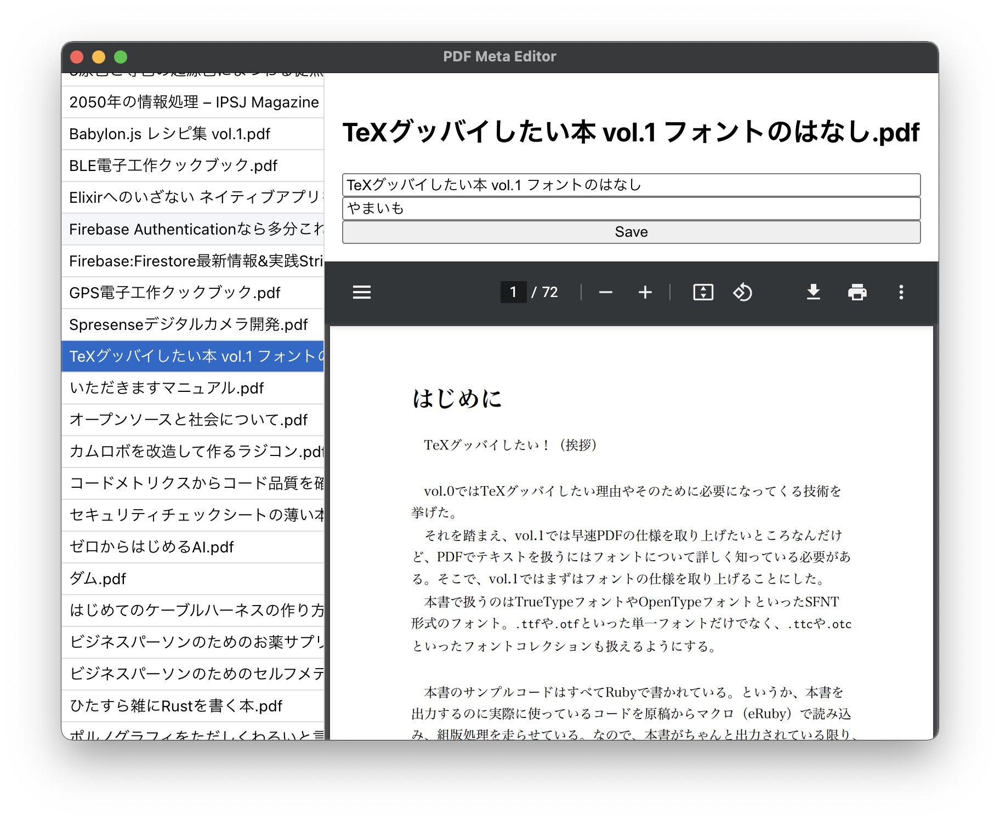

# PDF Meta Editor

A simple GUI editor for PDF metadata using [ExifTool](https://exiftool.org/).



## Getting Started

This editor requires ExifTool. You can install ExifTool with some package managers.

```shell-session
# Ubuntu, etc.
sudo apt install exiftool

# macOS
brew install exiftool

# Windows
choco install exiftool
```

To build, it uses npm, just type following command.

```shell-session
npm run build
```

## Development

```shell-session
npm run dev
```
